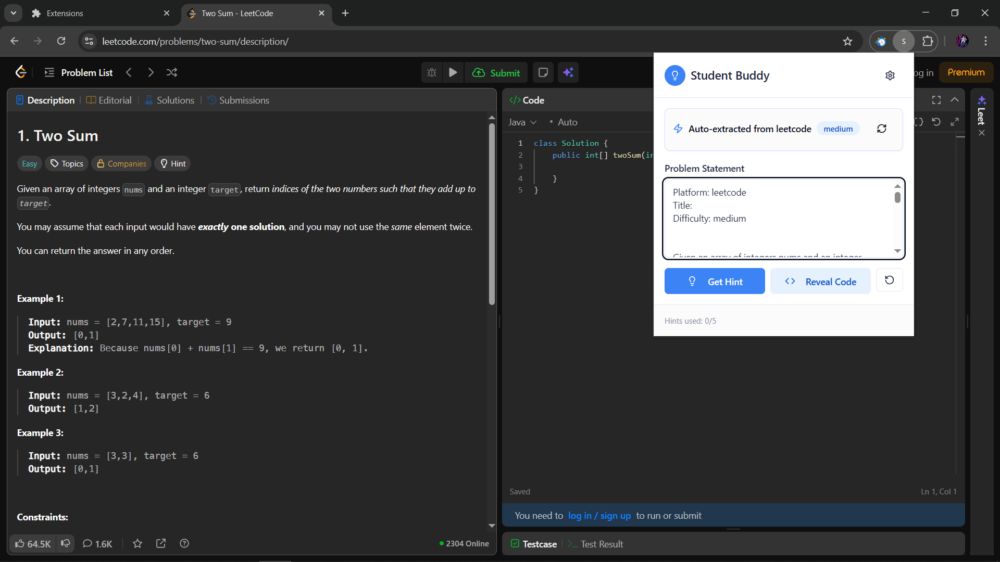
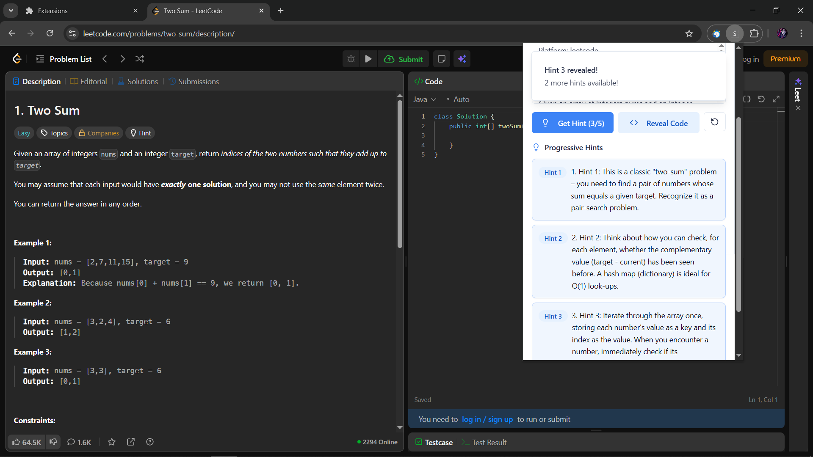
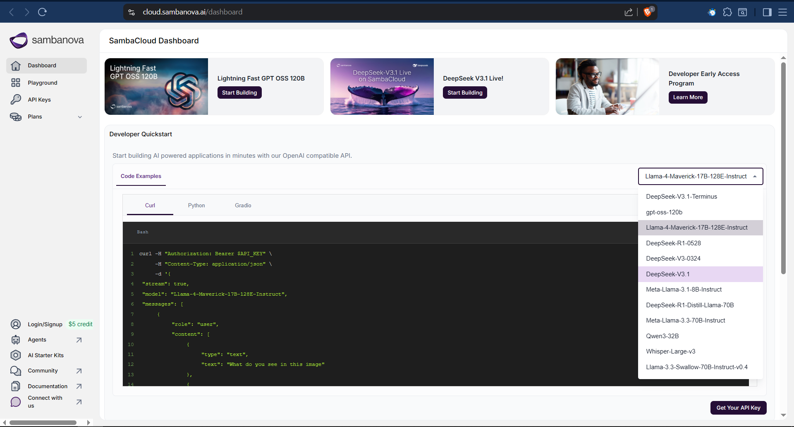

# 🎓 Student Buddy  

**Student Buddy** is a Chrome Extension that acts as a smart learning companion for coding practice. It integrates directly with popular coding platforms and provides **AI-powered hints, explanations, and solutions**—ensuring students never feel stuck.  

Unlike traditional single-model tools, **Student Buddy is powered by [SambaNova Cloud API](https://cloud.sambanova.ai/)** and supports **multi-model switching**: when one model’s tokens are exhausted, you can switch to another available model, guaranteeing **uninterrupted assistance**.  

---

## 🌟 Features  

- 🔗 **Seamless Integration** with:  
  - LeetCode  
  - HackerRank  
  - CodeForces  

- 🤖 **AI Assistance**  
  - Get instant hints, code explanations, and problem-solving strategies.  
  - Powered by **SambaNova Cloud API**.  

- 🔄 **Multi-Model Support**  
  - Choose from multiple SambaNova models.  
  - Automatic fallback if tokens for a model run out → smooth learning experience.  

- 🎨 **Customizable UI**  
  - Dark/Light theme support.  
  - Modern design with [Shadcn/UI](https://ui.shadcn.com/).  

- ⚡ **Responsive & Lightweight**  
  - Works across desktop and mobile resolutions.  
  - Optimized for performance.  

---

## 📹 Demo  

🎥 [Watch the Demo Video](https://cap.so/s/fm6fank1ma125yx))  

---

## 🏗️ Project Structure  

**Frontend**  
- React + Vite + TypeScript  
- Shadcn/UI components  
- Browser extension with theme customization  

**Backend**  
- Node.js + Express server  
- SambaNova API integration (multi-model)  
- Error logging and monitoring  
- RESTful APIs  

---

## 🚀 Getting Started  

### Prerequisites  
- Node.js (v18 or higher)  
- Bun package manager  
- Docker (optional, for containerization)  

### Installation  

1. Clone the repository:  
   ```bash
   git clone https://github.com/IndraJeet-09/Student-buddy.git
   cd Student-buddy
   ```

2. Backend Setup:  
   ```bash
   cd backend
   npm install
   # Create .env file with necessary environment variables
   npm run dev
   ```

3. Frontend Setup:  
   ```bash
   cd frontend
   bun install
   bun run dev
   ```

4. Browser Extension Setup:  
   ```bash
   cd frontend
   bun run build
   # Open Chrome → chrome://extensions/ → Enable Developer Mode
   # Click "Load unpacked" → Select the dist/ folder
   ```

---

## 🔧 Environment Variables  

### Backend (`/backend/.env`)  
```env
PORT=3000
SAMBANOVA_API_KEY=your_api_key
SAMBANOVA_MODEL=your_model
```

### Frontend (`/frontend/.env`)  
```env
VITE_API_URL=http://localhost:3000
```

---

## 🐳 Docker Support  

Run the entire stack using Docker Compose:  

```bash
docker-compose up
```

---

## 📝 API Endpoints  

The backend provides RESTful APIs for:  
- ✅ Health checks  
- ✅ AI question processing  
- ✅ Model switching & fallback  

Base URL: `http://localhost:3000`  

---
  
## 📸 Screenshots

### Home Page


### Example Problem Assistance


### Dark Theme


### Choose Model

---

## 🤝 Contributing  

1. Fork the repository  
2. Create a feature branch (`git checkout -b feature/YourFeature`)  
3. Commit changes (`git commit -m 'Add new feature'`)  
4. Push (`git push origin feature/YourFeature`)  
5. Open a Pull Request  

---

## 📜 License  

Licensed under the MIT License – see the [LICENSE](LICENSE) file.  

---

## 👥 Author  

- [IndraJeet-09](https://github.com/IndraJeet-09)  

---

## 🙏 Acknowledgments  

- [SambaNova Cloud](https://cloud.sambanova.ai/) – AI model APIs  
- [Shadcn/UI](https://ui.shadcn.com/) – UI components  
- All contributors & supporters  

---

⚡ With **Student Buddy**, you’re never stuck alone on coding problems—your AI companion is always ready to help!  
](https://cap.so/s/fm6fank1ma125yx)
